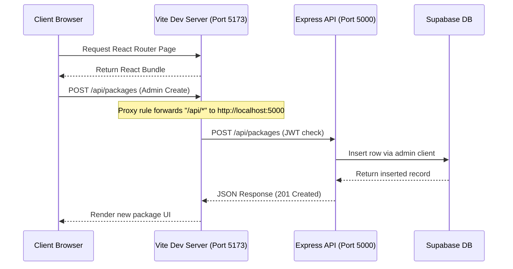
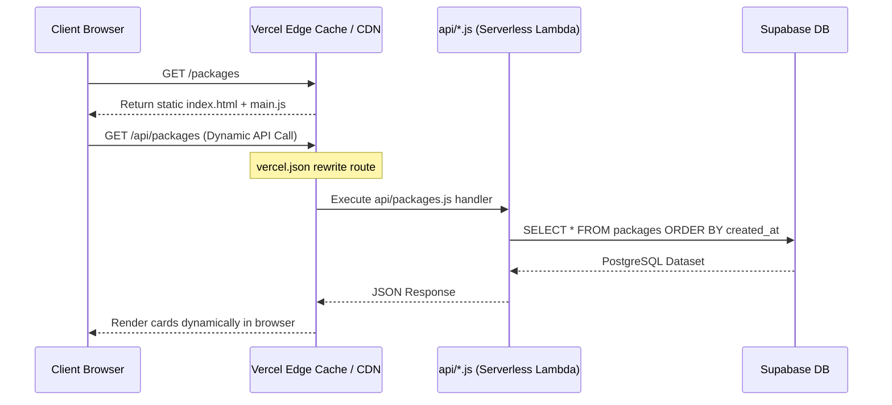

# 🏛 System Architecture Guide

Welcome to the architectural documentation for **Rehman Umrah & Travels** (also branded as **Royal Travels & Tours**). This document outlines the technology stack, codebase structure, and execution lifecycles of the application.

---

## 🚀 High-Level Tech Stack

The application is built using a modern **Serverless/MERN hybrid architecture** backed by **Supabase**:

*   **Frontend**: React (v19) built with Vite (v8) and styled with Tailwind CSS (v4) with vanilla CSS overrides.
*   **Database & Storage**: Supabase (PostgreSQL with Row Level Security and active storage buckets for image/media uploads).
*   **Server Options**:
    *   **Standalone Backend**: Node.js and Express (v5) standalone server using Mongoose (reference model) and `@supabase/supabase-js`.
    *   **Serverless Cloud Backend**: Vercel Serverless Functions (`api/` handlers written in CommonJS Node.js) for cloud deployment.
*   **Authentication**: JSON Web Token (JWT) matching admin credentials for dashboard modification operations.

---

## 📁 Repository Directory Tree

Below is the directory map of the codebase:

```text
rehman-umrah-travels/
├── api/                             # ⚡ Vercel Serverless API Handlers
│   ├── _utils/
│   │   └── supabase.js              # Supabase Client initializations (Public & Service clients)
│   ├── auth/
│   │   └── login.js                 # Admin credentials validation and JWT generation
│   ├── blog.js                      # Blog posts serverless endpoint
│   ├── cms.js                       # Site content management endpoint
│   ├── flights.js                   # Flight searches and listings handler
│   ├── gallery.js                   # Gallery media listings endpoint
│   ├── health.js                    # Service status checks
│   ├── packages.js                  # Package CRUD + seed triggers
│   ├── tours.js                     # International tours handler
│   └── visa.js                      # Visa services database queries
├── client/                          # 🎨 React + Vite Frontend App
│   ├── public/                      # Static client assets (favicon, direct media)
│   ├── src/
│   │   ├── assets/                  # Brand logos, hero images, and static graphics
│   │   ├── components/              # Global widgets (Navbar, Footer, Contact Form, WhatsApp)
│   │   ├── pages/                   # Application views (Home, Home2, Home3, Flights, Admin panel, etc.)
│   │   │   └── Admin/               # Dashboard interface and login page for site management
│   │   ├── App.css                  # Custom site layouts and theme styles
│   │   ├── App.jsx                  # React Router mapping
│   │   ├── index.css                # CSS variables, fonts (Poppins setup), and Tailwind triggers
│   │   └── main.jsx                 # Client entry point
│   ├── package.json                 # Client dependencies & scripts
│   ├── tailwind.config.js           # Font overrides and color configurations
│   └── vite.config.js               # Dev server configuration with Express proxy rules
├── server/                          # 🗄 Standalone Express Backend
│   ├── middleware/
│   │   └── auth.js                  # JWT validation middleware for route protection
│   ├── models/
│   │   └── Package.js               # Mongoose Schema reference model (MongoDB)
│   ├── routes/
│   │   ├── authRoutes.js            # JWT Login API
│   │   └── packageRoutes.js         # Express routes mapping to Supabase commands
│   ├── index.js                     # Express application bootstrap
│   └── package.json                 # Express server dependencies
├── vercel.json                      # Vercel Serverless routing rewrites
├── supabase-setup.sql               # Full SQL setup script (Tables, policies, and seeds)
└── package.json                     # Monorepo concurrently launcher scripts
```

---

## 🔄 Request Flow Lifecycle

The system utilizes two primary environments: **Local Development** (Express + Vite) and **Production Deployment** (Vercel Serverless + Built Assets).

### 1. Local Development Lifecycle (Concurrently)


### 2. Vercel Serverless Lifecycle (Production)


---

## 💡 Key Architectural Details

1.  **Vercel Rewrites**: Defined in `vercel.json`, it routes all generic paths (like `/packages` or `/visa-services`) to `client/dist/index.html` to support Client-Side Routing (`react-router-dom`), while translating `/api/*` into exact serverless folder endpoints under `/api`.
2.  **Double Database Client Strategy**:
    *   **Public Client**: Authenticated with the `anon/public` key. It respects database Row Level Security (RLS) policies. Used for fetching package cards, blog articles, and images safely.
    *   **Admin Client**: Authenticated with the `service_role` key. It bypasses RLS policies entirely. Utilized securely in server endpoints for modification methods (POST, PUT, DELETE) behind JWT authentication guards.
